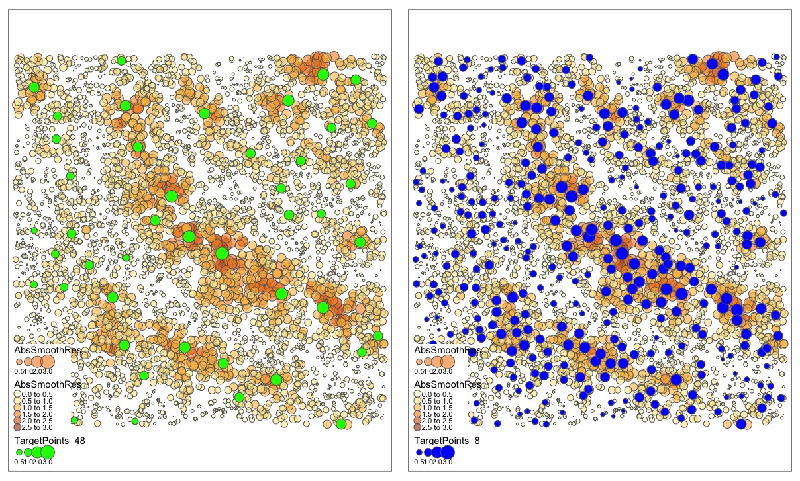

```{r setup, include = FALSE}
knitr::opts_chunk$set(
  collapse = TRUE,
  comment = "#>"
)


```

Introduction
===
In most application fields and disciplines, the continuous increase in the sample size of spatial data, both in terms of volume and richness of explanatory variables, has raised problems in the use of Geographically Weighted Regression (GWR, Brunsdon et al. 1996; McMillen, 1996) in recent years. As the spatial extent of a sample increases, its spatial resolution and the richness of the explanatory variables also increase and it becomes increasingly necessary to take spatial heterogeneity into account. This can impose computation times that may seem prohibitive for GWR methods. In 2017, the use of GWR methods on samples of more than 50,000 observations was not really feasible and some authors have proposed improvements to meet the challenges of using GWR with bigdata. The two main problems concern here the time required to calculate each local coefficients and the memory requirements imposed for storing the hat matrix of size $n \times n$ for estimating variance of parameters.
To answer to these two issues, various avenues have been explored:

1. Optimization of routines for calculating local regression and spatial weight matrix (lower level language, sparse weight matrix),
2. Avoiding to store the hat matrix,
3. Use of adaptive kernels based on K-nearest neighbors,
4. Paralellization of local models and distance calculations,
5. Improvement of bandwidth selection procedures,
6. Use a subset of local models, i.e. reduce the number of target points.

Indeed, one can use a limited set of evaluation points (or target points) and interpolation methods to generalize the fit to others points for speeding up the computation. In the more general context of locally weighted regression, Loader (1999) proposed an interpolation method based on an adaptive decision tree approach using local density of points. In non-parametric literature, this type of two stages strategy that consists to approximate a function on a limited set of points and to extrapolate it is fairly usual: the famous Super Smoother algorithm of Friedman (1984) is based on this idea. There are a wide variety of proposals for KDEs and regression kernels on how to choose a subset of points to obtain the best extrapolations with the least computational load possible. It could be based on the density of observations, the complexity of curves or by equidistributing them on the support of the function.

The release 1.0 of mgwrsar package proposes two improvements to speed up the computation of the GWR like  models considered in the previous release of mgwrsar package, with or without spatial autocorrelation, through the joint use of Gaussian rough kernel and estimations based on target points subset.
It proposes:
- use of target points : a method that considers a two stage procedure with computation of local regression on a subset of target points with three ways of selecting the and extrapolation on the full sample in a second stage.  
- use of gaussian rough kernel : a method in which only the distance to the $NN$ first neighbors are computed, with $NN$ sufficiently large to contain optimal bandwidth, but sufficiently small to reduce significantly the number of distance computation and the number on non null weights in local samples.

If we consider a sample of 4000 observations, the use of Gaussian rough kernel accelerates GWR computation by a factor of 2.5 without significant bias in the coefficients. Moreover, the use of suitable target points set accelerates GWR computation by a factor of 50 and surprisingly reduces the bias for final local coefficients by improving the choice of optimal bandwidth (see Geniaux 2022, in prep). 

This package proposes two ways of selecting target points, first by using a quadcell algorithm based on the local density of locations, second by considering spatial smooth of residuals of a first stage OLS model. The later method outperforms in general the equidistributed method based on the local density of locations, particularly when the size of target points is smaller than 25 % of the locations. This way of selecting  target points is proposed as default method in this release.


```{r load_data}
library(mgwrsar)
## loading data example
data(mydata)
coord=as.matrix(mydata[,c("x","y")])
```
The GWR model can be expressed as:
\begin{equation}
y_{i}=\sum_{j=1}^{J}\beta_{j}(u_{i},v_{i})x_{ij}+\epsilon_{i} \;\;\; i=1,2,..,n
\label{modelGWR} 
\end{equation}
where $J$ is the number of exogenous regressors, $x_{ij}$ is the regressor $j$ for the observation $i$ and may be an intercept. 

The estimator for $\beta_{j}(u_{i},v_{i})$ is :
\begin{equation}
\hat{\beta}(u_{i},v_{i})=(X'W_{i}X)^{-1} X'W_{i}Y
\label{BetaGWR} 
\end{equation}

If we note $W$ a spatial weight matrix based on a distance decay kernel or using k-nearest neighbors, then $W_{i}$ is the diagonal spatial weight matrix $n\times n$  specific to location $i$, with a diagonal composed by the ith row of $W$ and zero for all others elements. Usual kernels are the Gaussian and bisquare kernels, with a bandwidth defined in distance or in number or neighbours for adaptive kernels.

GWR model with rough gaussian kernel
---
One way to speed up GWR model estimation and to reduce the required amount of memory consists in increasing sparsity of the weight matrix $W$. When one use $k$ first neighbors weighting scheme or an adaptive kernel with null weights beyond bandwidth (like bisquare, trisquare, epanelechnikov, triangle or rectangle), then $W$ is very sparse when the bandwidth is small. When Gaussian like kernels are used then one way to increase sparsity of $W$ is to use truncated Gaussian kernels that shrink to zero weights when weights are very small or when it concerns observations beyond a given number of neighbors.

In the first example, we show how to compute a GWR model without or with rough Gaussian kernel: we use an optimal bandwidth $H$ of 0.3, corresponding on average to the distance to the 25th neighbor and for the rough Gaussian kernel, only the first 300 neighbors (*NN=300*) are taken into account in the distance and weight calculations. We can observe in this case that the computation time is divided by 2. The larger the sample, the greater the relative improvement. We notice in this example where the optimal bandwidth is far from the bound used to truncate the kernel, that the use of a rough Gaussian kernel has no detrimental effect.  When the optimal bandwidth is closer to the neighborhood used to truncate the Gaussian kernel, then the differences in the approximation will be larger and it may be recommended to increase the $NN$ parameter that defines the truncation neighborhood of the Gaussian kernel.

```{r GWR_NN}

## without rough gaussian kernel
ptm1<-proc.time()
model_GWR<-MGWRSAR(formula = 'Y_gwr~X1+X2+X3', data = mydata,coord=coord, fixed_vars=NULL,kernels=c('gauss'),H=0.03, Model = 'GWR',control=list(SE=TRUE))
(proc.time()-ptm1)[3]

## with rough gaussian kernel
ptm1<-proc.time()
model_GWR_grk<-MGWRSAR(formula = 'Y_gwr~X1+X2+X3', data = mydata,coord=coord, fixed_vars=NULL,kernels=c('gauss'),H=0.03, Model = 'GWR',control=list(SE=TRUE,NN=300))
(proc.time()-ptm1)[3]

summary(model_GWR$Betav)
summary(model_GWR_grk$Betav)

```

GWR model with target points
---

In the second example, we show how to compute a GWR model with sample of target points using mgwrsar 1.0. Choosing target points with respect to the spatial distribution of residuals of a first stage OLS regression is preferable to select target point with respect to density of locations; this option can be choosen using *type='residuals'* as control variable in mgwrsar function.

The selection of target points with *type='residuals'* uses 3 steps:

1. In a first step, we fit an initial linear model without taking into account spatial heterogeneity, using OLS, and get the residuals.
2. In a second step, in order to identify hot spots of residuals, we smooth the first stage residuals using a k-nearest neighbors kernel with $K$ as number of neighbors,
3. In a third step, the selection of the target points is done by selecting the points where the absolute value of the smoothed residuals is locally the highest among a $kWtp$ neighborhood.

In order to get local maxima at fine scale, we use between twelve and sixteen neighbors (default) for $kWtp$. In the last step, the value of $K$ allow to increase/decrease the number of local maxima chosen. The choice of $kWtp$ is less critical than $K$. The resulting number of target points depends both on $K$ and on the spatial distribution of residuals. The more $K$ increases, the more the number of target points decreases: the size of resulting target points set is less than $n/K$. 

To illustrate the methodology, we simulate a single run of the GWR DGP proposed by Geniaux and Martinetti (2017a) and apply the selection of target points with respect to first stage OLS residuals. The two figures 1 maps the value of the absolute value of the smoothed (with $kWtp = 16$) residuals of the linear model, and the chosen target points when $K$ is set to 48 (green points), and when parameter $K$ is set to 8 (blue points). We can see on the map on the left that the absolute value of the smoothed residual of the green target points is higher than for their 48 closest neighbors.

{width=700px}


In the following example, the function $find_TP$ is used to identify a target point set with $K$=6 that leads to choose 91 targets points, that are then used in  MGWRSAR function : MGWRSAR function first compute the local $\beta(u_i,v_i)$ coefficients for the 91 sub-samples ($i %in% TP$) and then extrapolate the local $\beta(u_i,v_i)$ coefficients for the 909 other locations. 

As expected approximation of$\beta(u_i,v_i)$ coefficients using this target point set are different from those obtained with full GWR, with small difference for the mean of coefficients, but with smaller range and variance, for result with target points. The time calculation is divided by 10 and, as mentionned before, the larger the sample, the greater the relative improvement is, with a time calculation divided by 50 for big sample, particularly if this method is used in conjunction with rough gaussian kernel (see Geniaux 2022, in prep).

```{r GWR_TP}
TP=find_TP(formula = 'Y_gwr~X1+X2+X3', data =mydata,coord=coord,K=6,type='residuals')
# only 60 targets points are used
length(TP)

ptm1<-proc.time()
model_GWR_tp<-MGWRSAR(formula = 'Y_gwr~X1+X2+X3', data = mydata,coord=coord, fixed_vars=NULL,kernels=c('gauss'),H=0.03, Model = 'GWR',control=list(SE=TRUE,TP=TP,kWtp=12))
(proc.time()-ptm1)[3]

ptm1<-proc.time()
model_GWR_tp_NN<-MGWRSAR(formula = 'Y_gwr~X1+X2+X3', data = mydata,coord=coord, fixed_vars=NULL,kernels=c('gauss'),H=0.03, Model = 'GWR',control=list(SE=TRUE,TP=TP,kWtp=12,NN=300))
(proc.time()-ptm1)[3]

summary(model_GWR$Betav)
summary(model_GWR_tp$Betav)
summary(model_GWR_tp_NN$Betav)

```


Prediction with target points
----

In this example, we use an in-sample of size 800 for model estimation and an out-sample of size 200 for prediction.  Note that for model with spatial autocorrelation you must provide a global weight matrix of size 1000, ordered by in-sample then out-sample locations. 

For GWR and MGWR_1_0_kv,  where all coefficients vary in space, the predictions are carried out using the corresponding model estimate with the out-sample location as target points, so the estimated coefficients nor the target points choosen for estimating the model are not used: only the call and the data of the estimated model are used. 

For mixed model that have some constant coefficients (MGWR, MGXWR_0_0_kv, MGXWR_1_kc_kv, MGXWR_1_kc_0), the estimated coefficients (only the one of target points) are extrapolated using a weighting matrix. By default, the weighting matrix for prediction is based on the expected weights of outsample data if they were had been added to in-sample data to estimate the corresponding MGWRSAR (see Geniaux 2022, in prep, for further detail). The user can also choose to extrapolate the model coefficients using a shepperd kernel with custom number of neighbors or using the same kernel and bandwidth as the estimated model.

Predictions of GWR model using sheppard kernel with 8 neighbors:

```{r Prediction1, eval=FALSE}

length_out=800
index_in=sample(1:1000,length_out)
index_out=(1:1000)[-index_in]

coord_in=coord[index_in,]
data_in=mydata[index_in,]

TP=find_TP(formula = 'Y_gwr~X1+X2+X3', data =data_in,coord=coord_in,K=6,type='residuals')
# only 60 targets points are used
length(TP)

model_GWR_insample<-MGWRSAR(formula = 'Y_gwr~X1+X2+X3', data = mydata[index_in,],coord=coord[index_in,], fixed_vars=NULL,kernels=c('gauss'),H=10, Model = 'GWR',control=list(adaptive=T,TP=TP))
summary_mgwrsar(model_GWR_insample)

newdata=mydata[index_out,]
newdata_coord=coord[index_out,]
newdata$Y_gwr=0

Y_pred=predict_mgwrsar(model_GWR_insample, newdata=newdata, newdata_coord=newdata_coord,method_pred='tWtp_model')
head(Y_pred)
head(mydata$Y_gwr[index_out])
sqrt(mean((mydata$Y_gwr[index_out]-Y_pred)^2)) # RMSE
```

Prediction of *MGWRSAR_1_0_kv* model using sheppard kernel with 4 neighbors and Best Linear Unbiased Predictor (BLUP) :
```{r Prediction2,  eval=FALSE}


length_out=800
index_in=sample(1:1000,length_out)
index_out=(1:1000)[-index_in]

### Global Spatial Weight matrix W should be ordered by in_ sample (S) then out_sample
W=kernel_matW(H=4,kernels='rectangle',coord_i=rbind(coord[index_in,],coord[index_out,]),NN=4,adaptive=TRUE,diagnull=TRUE,rowNorm=T)

W_in=kernel_matW(H=4,kernels='rectangle',coord_i=coord[index_in,],NN=4,adaptive=TRUE,diagnull=TRUE,rowNorm=T)

model_MGWRSAR_1_0_kv_insample<-MGWRSAR(formula = 'Y_mgwrsar_1_0_kv~X1+X2+X3', data = mydata[index_in,],coord=coord[index_in,], fixed_vars=NULL,kernels=c('gauss'),H=11, Model = 'MGWRSAR_1_0_kv',control=list(W=W_in,adaptive=TRUE,isgcv=F))
model_MGWRSAR_1_0_kv_insample$RMSE
summary_mgwrsar(model_MGWRSAR_1_0_kv_insample)

## without Best Linear Unbiased Predictor
newdata=mydata[index_out,]
newdata_coord=coord[index_out,]
newdata$Y_mgwrsar_1_0_kv=0

Y_pred=predict_mgwrsar(model_MGWRSAR_1_0_kv_insample, newdata=newdata, newdata_coord=newdata_coord,W=W,type='YTC')
head(Y_pred)
RMSE_YTC=sqrt(mean((mydata$Y_mgwrsar_1_0_kv[index_out]-Y_pred)^2))
RMSE_YTC

## Using Best Linear Unbiased Predictor
Y_pred=predict_mgwrsar(model_MGWRSAR_1_0_kv_insample, newdata=newdata, newdata_coord=newdata_coord,W=W,type='BPN')
head(Y_pred)
RMSE_BPN=sqrt(mean((mydata$Y_mgwrsar_1_0_kv[index_out]-Y_pred)^2))
RMSE_BPN

```


Accelerate the search for optimal bandwidth
---

The two approximation methods proposed before can be use to reduce time for finding the optimal bandwith, and are available in the *bandwiths_MGWRASR* function. The next example compares the time for finding an optimal bandwidth for full GWR and for GWR with target points sample and rough gaussian kernel.

Time for finding the optimal bandwith is divided by around 8, and here again, larger improvements can be achieved when sample size are larger. In this example, the optimal bandwidth is smaller for methods with target points: this result is specific to this simulation and the opposite can be true  with different data. If GWR with target points reached lower LOOCV in this example, it can not be compared to the LOOCV of full GWR because computation of Leave-One-Out Cross validation criteria (LOOCV) that are comparable between full GWR and GWR with target point is extremely complex and time consuming, mgwrsar 1.0 use only the LOOCV of target points for choosing the optimal bandwidth. If the user want to compare out-sample accuracy of the two methods, k-fold cross validation can be performed to compare the GWR method with and without target points.


```{r bandwidths_mgwrsar with TP and NN, eval=FALSE}

ptm1<-proc.time()
mytab_TP_NN<-bandwidths_mgwrsar(formula = 'Y_gwr~X1+X2+X3', data = mydata,coord=coord, fixed_vars=NULL,Models=c('GWR'),candidates_Kernels=c('gauss'),control=list(TP=TP,NN=300,adaptive=FALSE),control_search=list())
(proc.time()-ptm1)[3]

names(mytab_TP_NN)
names(mytab_TP_NN[['GWR_gauss']])
mytab_TP_NN[['GWR_gauss']]$config_model


ptm1<-proc.time()
mytab<-bandwidths_mgwrsar(formula = 'Y_gwr~X1+X2+X3', data = mydata,coord=coord, fixed_vars=NULL,Models=c('GWR'),candidates_Kernels=c('gauss'),control=list(adaptive=FALSE),control_search=list())
(proc.time()-ptm1)[3]

names(mytab)
names(mytab[['GWR_gauss']])
mytab[['GWR_gauss']]$config_model

```

    #####  GWR  #####
    #####  gauss  adaptive= FALSE  #####
    
    ########
    Search bandwidth stage
    ########
    
     ..............kernel = gauss   objective =  0.09682568  minimum =      0.04315604 
    
    elapsed 
      0.704 
    [1] "GWR_gauss"
    [1] "config_model" "CV"           "SSR"          "model"       
    [5] "ctime"       
    $Model
    [1] "GWR"
    
    $kernels
    [1] "gauss"
    
    $adaptive
    [1] FALSE
    
    $H
          0.1% 
    0.04315604 
    
    $kernel_w
    [1] "rectangle"
    
    $h_w
    NULL
    
    #####  GWR  #####
    #####  gauss  adaptive= FALSE  #####
    
    ########
    Search bandwidth stage
    ########
    
     .................kernel = gauss   objective =  0.08993343  minimum =     0.030763 
    
    elapsed 
      6.972 
    [1] "GWR_gauss"
    [1] "config_model" "CV"           "SSR"          "model"       
    [5] "ctime"       
    $Model
    [1] "GWR"
    
    $kernels
    [1] "gauss"
    
    $adaptive
    [1] FALSE
    
    $H
        0.1% 
    0.030763 
    
    $kernel_w
    [1] "rectangle"
    
    $h_w
    NULL
    
References
===

Brunsdon, C., Fotheringham, A., Charlton, M., 1996. *Geographically weighted regression: a method for exploring spatial nonstationarity*. Geogr. Anal. 28 (4), 281–298.

Friedman, J. H. 1984. *A variable span smoother*. Laboratory for Computational Statistics, Department of Statistics, Stanford University: Technical Report(5).

Geniaux, G. and Martinetti, D. 2017a.  *A new method for dealing simultaneously with spatial autocorrelation and spatial heterogeneity in regression models*. Regional Science and Urban Economics, 2017

Geniaux, G. and Martinetti, D. 2017b. R package mgwrsar: Functions for computing (mixed) geographycally weighted regression with spatial autocorrelation,. https://CRAN.R-project.org/package=mgwrsar.

Geniaux, G. 2022. Speeding up estimation of spatially varying coefficients models, INRAe working Paper.

Loader, C. 1999. *Local regression and likelihood*, volume 47. springer New York.

McMillen, D. P. 1996. *One hundred fifty years of land values in chicago: A nonparametric approach*. Journal of Urban Economics, 40(1):100 – 124.
